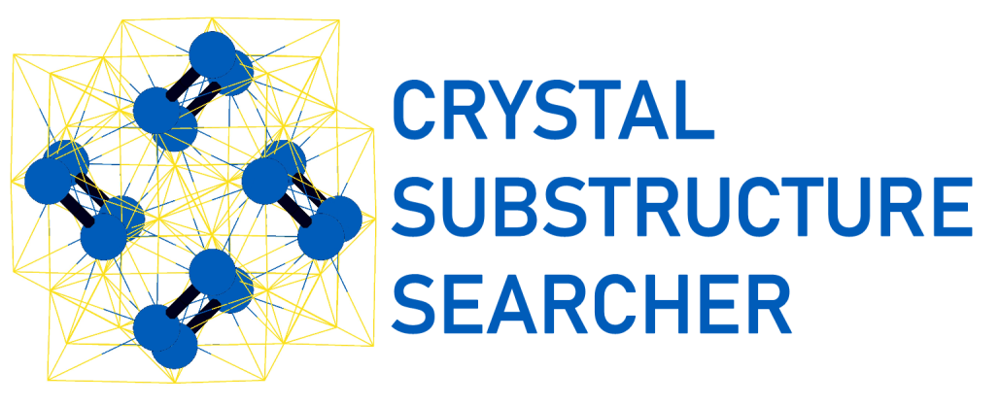
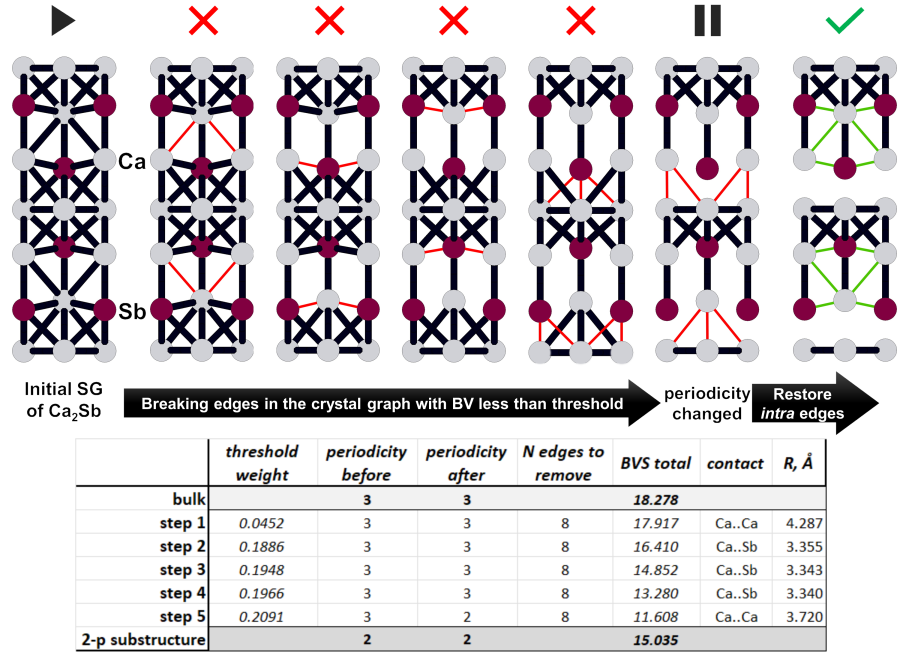

# CrystalSubstructureSearcher
*CrystalSubstructureSearcher* is an open-source program for analyzing crystal structures and identifying low-periodic substructures (layers, chains, and molecular fragments) within them.

## Overview

The discovery of new two-dimensional materials is vital for advancing electronics and quantum technologies. As most 2D materials originate from layered bulk structures, identifying exfoliable crystals is a critical first step.

## Key Features

- **Automated substructure identification**: Identifies 2D layers, 1D chains, and 0D molecular fragments within crystal structures
- **Graph-based analysis**: Constructs structure graphs using Voronoi tessellation to represent atomic connectivity
- **Bond strength characterization**: Allows for selection of bond strength descriptors (distance, Voronoi face area, solid angle, bond valence) as proxies for bond strength
- **Fragment charge estimation**: Analyzes electronegativity differences and bond valences to estimate charge distribution
- **Bond valence sum descriptors**: Computes comprehensive descriptors characterizing bond strength distribution

## Input/Output

- **Input**: CIF files containing crystal structure data
- **Output**: Identified substructures with their periodicities, bond strength descriptors, and charge estimates

## Algorithm
The program uses an iterative edge-removal algorithm that progressively breaks the weakest bonds (based on user-selected bond strength descriptor) and monitors changes in structural periodicity.

**Figure 1.** *The first iterations of the Ca2Sb structure (ICSD refcode 154) analysis leading to identification of the 2-periodic substructure. The bond valences are selected as edge weight in this example. The edges of the structure graph broken at each iteration are highlighted in red, their characteristics are shown in the table below. The edges restored at the final step are shown in green. BVS total is the sum of the bond valences of the retained edges in the graph components.*
